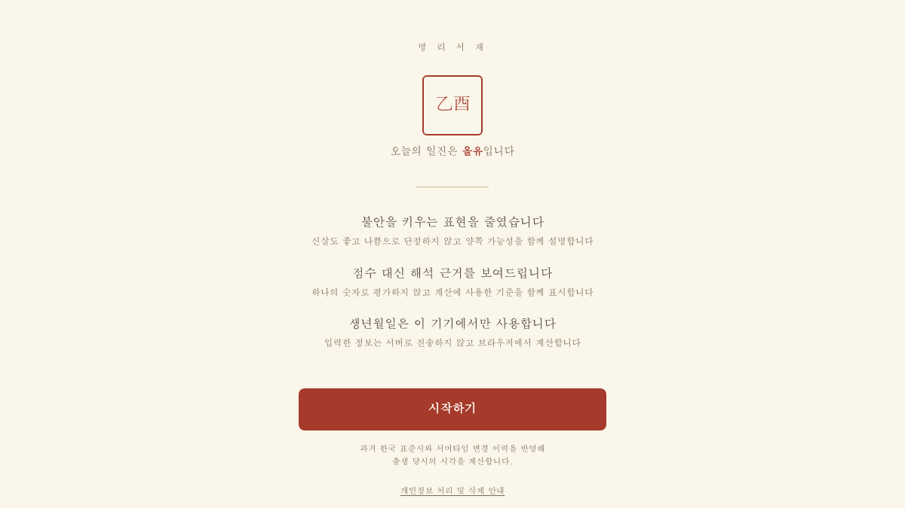

# Myeongri Saje (명리서재)

[한국어](README.md) | **English**

**A saju site that unfolds your life in 10-year cycles.**
No fear-mongering, no scoring, no personal data collection.

<sub>React 19 · TypeScript · Vite · Tailwind v4 · Zustand · Vitest · Playwright · MCP</sub>

[Demo](https://saju-blond-six.vercel.app) · [Accuracy](docs/accuracy.md) · [Screens & Motion](docs/ux.md)



---

Instead of reducing a daily fortune to a score, the service presents past and future periods on a ten-year timeline. It shows the basis of each calculation and lets users compare the result with their own experience rather than declaring that an interpretation is correct.

Small errors in a day pillar or the start of a daeun cycle can shift the full timeline. The implementation is checked against independent algorithms and astronomical data, with tests covering date, timezone, and solar-term boundaries.

## Screens

| Intro | Calculation Basis | Life Timeline |
|:--:|:--:|:--:|
|  |  |  |
| Introduces the interpretation and privacy policy before input | Shows values produced during each calculation step | Opens with the daeun timeline rather than a dense chart |

| Compatibility | Deep Dive | Life Report |
|:--:|:--:|:--:|
|  |  |  |
| Explains the relationship between two charts by category instead of one score | Separates gungwi, ohaeng balance, and yongsin into focused views | Includes calculation notes in an A4 printable report |

| Daeun Expanded | Where's the DOB Going? | Dead Link |
|:--:|:--:|:--:|
|  |  |  |
| Lets users add their own notes and compare them with each period | Explains how birth data is stored and transmitted in plain language | Provides a clear route back from an invalid URL |

## Tech Stack

| | |
|---|---|
| **Language · Build** | TypeScript 5.9 (`strict` + `noUncheckedIndexedAccess` + `verbatimModuleSyntax`) · Vite 6 |
| **UI** | React 19 · Tailwind CSS v4 (`@theme` tokens) · Animations are **CSS only** (0 bytes from libraries) |
| **State** | Zustand 5 — even routing stays in state (to keep DOB out of the URL) |
| **Domain Engine** | Built from scratch (`core/pillars.ts`) + self-generated solar term table (23.6KB) |
| **Lunar Calendar** | `korean-lunar-calendar` — Korean Astronomical Research Institute data |
| **Observability** | `@sentry/react` — PII redaction gate must pass before anything ships |
| **Testing** | Vitest 3 (**558**) · Playwright 1.62 (**252**, mobile · desktop · motion 3 suites) |
| **Verification Tools** | astronomy-engine (celestial mechanics) · lunar-javascript · manseryeok · **Python + skyfield/JPL DE421** |
| **Integration** | Model Context Protocol SDK — engine exposed as 6 MCP tools |
| **CI** | GitHub Actions — tzdata self-check → types → build → tests → E2E → golden re-diff |

### Actual Implementation Scope

- **Timezones and calendars** — IANA tzdata, true solar time (진태양시), two separate timelines
- **Celestial mechanics** — Solar apparent longitude, new moon (삭), mid-solar-terms to determine leap months
- **Data encoding** — 4,824 solar terms folded into delta + base-36 = 23.6KB
- **Bundle budget** — entry chunk pegged at 250KB, CI enforces it
- **Privacy engineering** — blocked four leakage paths for DOB, tests verify they stay blocked
- **Accessibility** — explanation screens for users who don't know saju terms, WCAG AA color contrast **computed directly from tokens and tested**, `prefers-reduced-motion`, large text mode, 44px touch targets
- **Validation design** — how do you verify a calculation when there's no answer key (e.g., yongsin, sinssal)?

## Summary

| | |
|---|---|
| Solar terms vs. celestial mechanics | 3,624 samples · max deviation **55.8 seconds** |
| Day cycle verified via Julian day | **73,414 days** checked |
| Structural rules (Five Tiger Tally, Five Rat Tally) | 11,172 cases · mismatches **0** |
| Cross-check with independent Python implementation | Pillar mismatches 0 |
| Entry chunk / engine chunk | 250KB budget / **100KB** (after removing calculation lib) |
| Lunar-calendar issue corrected | Replaced Chinese lunar data that shifted some Korean dates by one day |
| External request removed | Self-hosted fonts after identifying an unintended Google Fonts request |

## Read More

| Document | About |
|---|---|
| [Accuracy](docs/accuracy.md) | Korean standard time history · solar terms · day cycle · Korean lunar calendar · Python verification |
| [Architecture](docs/architecture.md) | Design decisions · bundle strategy · **all deploy gates** · hand-rolled checks |
| [Interpretation](docs/interpretation.md) | Yongsin · sinssal · **compatibility** · **today/new year** · reports · lookup tables · **glossary** |
| [Screens & Motion](docs/ux.md) | Intro · layout · animation · share links · **color contrast** · **self-hosted fonts** |
| [MCP Server](docs/mcp.md) | How to expose the engine as tools to other AIs |

## Quick Start

```bash
pnpm install
pnpm dev                # dev server
pnpm gate               # types + MCP build + unit tests
pnpm test:e2e           # Playwright
pnpm build:mcp          # MCP server → dist-mcp/server.js
pnpm verify:python 150  # cross-check vs. Python impl. (needs environment)
pnpm shots              # refresh screenshots for docs
pnpm docs:sync          # sync test counts in README
pnpm fonts              # re-download web fonts locally
pnpm gen:terms          # regenerate solar term table
```

## Not Implemented

- **KASI official check** — Solar terms verified directly against celestial mechanics (see "solar terms" above). Comparing to Korea Astronomy & Space Science Institute's public API is still in the backlog as `pnpm verify:kasi`, but public data portal key provisioning is manual, so we haven't run it live yet. We matched the response format from docs, so the first run needs `--raw` to verify.
- **Automate Python checks** — `pnpm verify:python` is run by hand. A 17MB ephemeris file per month in CI isn't practical, so it stays as a manual step after large changes.
- **Pre-1911 lunar calendar** — Korean lunar data in that range disagrees with KST rules in eight places. Since Korea didn't have standard time before the empire formalized it, we'd need to settle the baseline first. We still calculate 1900–1911 births, but the precision of lunar inputs is lower in that era than after.

---

## License

**Source-available — not open source.** We've published the code for reading, but we haven't granted usage rights. If you want to use it in another project, fork, redistribute, or commercialize it, you need written permission first. See [LICENSE](LICENSE) for the full terms, and [LICENSE.ko.md](LICENSE.ko.md) for Korean guidance.
